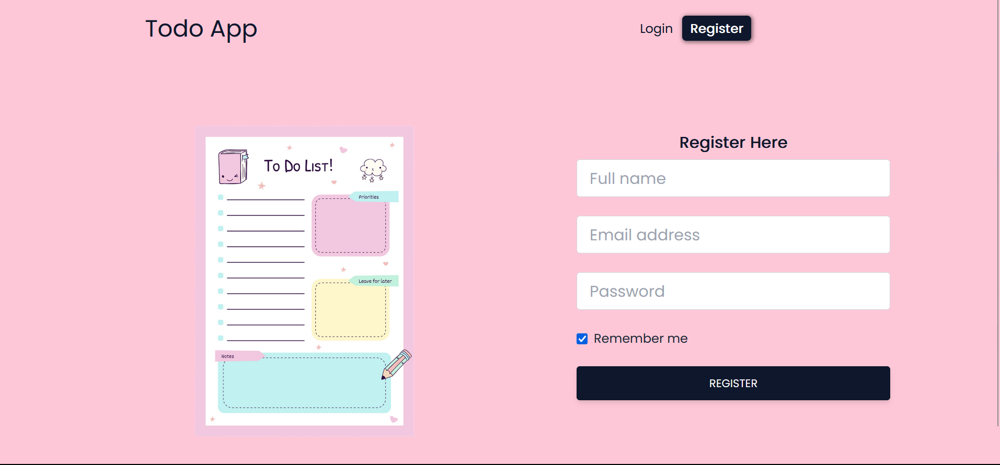
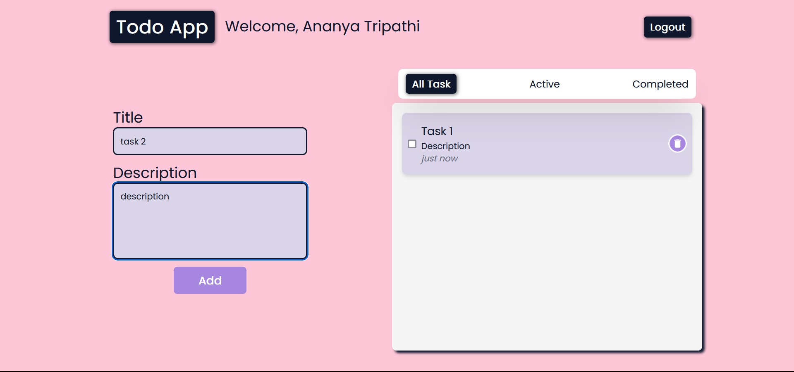

# Competishun Todo Assignment

This is a simple project that includes both a backend and a frontend for managing tasks. The backend is built with Node.js and MongoDB, while the frontend is a React application.

Screenshots





## Prerequisites

Before you begin, ensure you have the following prerequisites installed on your system:

- Node.js: Download and install it from [nodejs.org](https://nodejs.org/).
- MongoDB: You can install MongoDB locally or use a cloud-hosted MongoDB instance.

## Getting Started

Follow these steps to get the project up and running on your system:

1. Clone the repository:

   bash
   git clone https://github.com/Ananya-Tripathi/ToDoList


2. Navigate to the backend directory and create a .env file with the following content, replacing the values with your own:


MONGO_URI=Your MongoDB URI
GMAIL_USERNAME=your gmail address 
GMAIL_PASSWORD=password created inside the 'App Password' section under the Google Accounts setting
PORT=8000
JWT_SECRET=a random secret key eg. thisisasecretkey


Setting Up MongoDB Database
To set up a MongoDB database for this project, follow these steps:

Sign in to your MongoDB account or create a new one on the MongoDB Atlas website.

Create a new cluster and configure it according to your needs. Make note of the MongoDB connection URI provided by MongoDB Atlas.

Open the .env file in the backend directory and replace the MONGO_URI value with the MongoDB connection URI from step 2.

MONGO_URI='your-mongodb-connection-uri'
Save the .env file.

3. Install backend dependencies and start the server:


cd competishun-todo-assignment/backend
npm install
npm start


4. Open a new terminal window, navigate to the frontend directory, and install frontend dependencies:

cd ../frontend
npm install

5. Start the React app:
npm start```

Usage
Once the application is running, you can create, update, and delete tasks using the user-friendly interface.
Users can sign up and log in to manage their tasks.
Tasks are stored in the MongoDB database.
